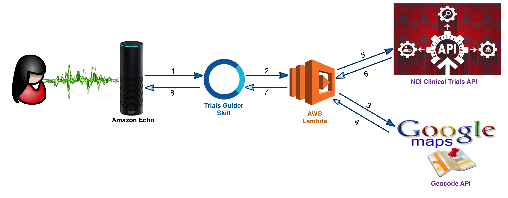
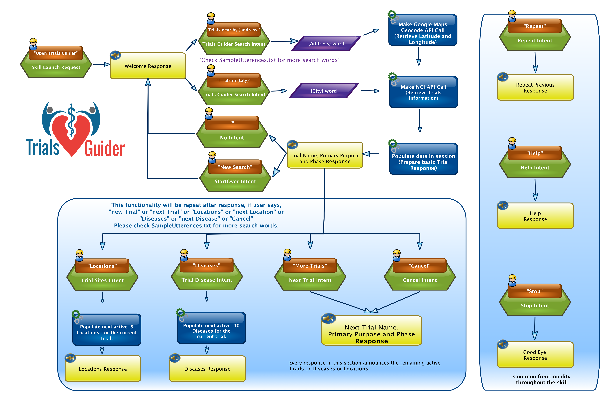

# Trails Guider

Cancer Clinical Trials are critically important to patients. This skill with Alexa helps patients to find the right trial for them in USA.



The making-of story of this skill can be found here: [Trials Guider at Hackster.io](https://www.hackster.io/enrich-your-thoughts/trialsguider-a02c99 "Trials Guider at The Amazon Alexa API Mashup Contest")

##Finding right active cancer clinical trial.
If you are interested in If you are interested in Trials Guider, go for something like:
```
"Alexa, Open trials guider"
"Search trials in {City}"
```
where {City} is any city name in USA of your choice.

With this intent Alexa plays back the number of active trials available in that city. Moreover, this skill provides all the trials information back to Alexa App.





##General features
"Repeat" during search plays back the previous response.

"Next" or "Next Trial" or "More Trials" at any time after the trials search, it will responded with the next trial information.

"Cancel" after the trials search will jump to the next trial.

"Stop" quits the skill and responded with the Thank You message and Good Bye!

"Help" gives more information about how to search trials.

##Trials Guider with Alexa Testing
<a href="https://www.youtube.com/watch?v=pE0b4rU-Y4s" target="_blank"></a>

***
“THIS TOOL DOES NOT PROVIDE MEDICAL ADVICE, AND IS FOR INFORMATIONAL AND EDUCATIONAL PURPOSES ONLY, AND IS NOT A SUBSTITUTE FOR PROFESSIONAL MEDICAL ADVICE, TREATMENT OR DIAGNOSIS. CALL YOUR DOCTOR TO RECEIVE MEDICAL ADVICE. IF YOU THINK YOU MAY HAVE A MEDICAL EMERGENCY, PLEASE DIAL 911.”
***
